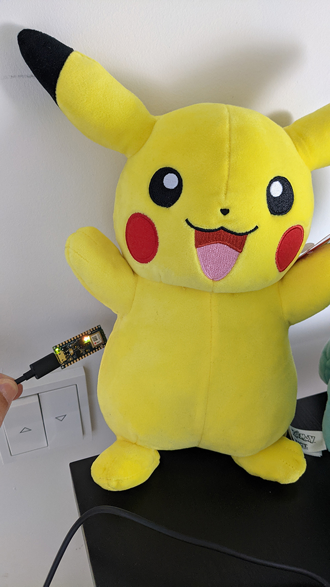
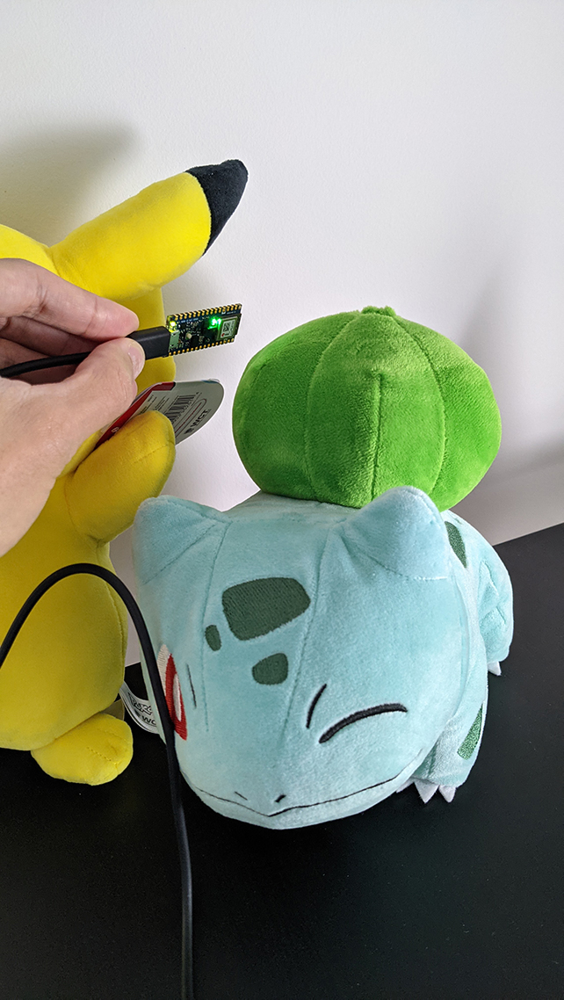

# Detecting Pokemon on an Arduino using TinyML and TensorFlow

## Overview
This repository contains the code and resources used in my experiment, "Detecting Pokemon on an Arduino using TinyML and TensorFlow." In this experiment, I'm using an  Arduino NANO 33 BLE Sense and the TensorFlow Lite for Microcontrollers library to create a classifier that predicts whether this Pokemon is Pikachu or Bulbasaur.

You can find the article at [Detecting Pokemon on an Arduino using TinyML and TensorFlow](https://juandes.com/detecting-pokemon-arduino-tinyml) Besides explaining how you can create a TensorFlow model for detecting the Pokémon Pikachu and Bulbasaur in the microprocessor, it covers the data collection procedure (done on the Arduino), a brief data analysis, training the model, how to convert said model to a format understood by the Arduino's TensorFlow Lite for Microcontrollers library, and how to deploy it on the device.

## The repo content
The repository contains:

- The classifier Arduino's Sketch, named *classifier.ino*.
- The data collection Arduino's Sketch, named *color-sampler.ino*.
- The model training script, named *train.py*.
- The code behind the data analysis, named *color-analysis.py*.
- The datasets I used for training in a directory named *data/*.
- Some of the plots I produced for the article in a directory named *plots/*.
- The classifier model in several formats:
  - TensorFlow SavedModel format (*model/savedmodel_20210108-190240/*) 
  - TensorFlow Lite format (*model/pika_bulba20210108-190240*)
  - TinyML format (*model.h*)

